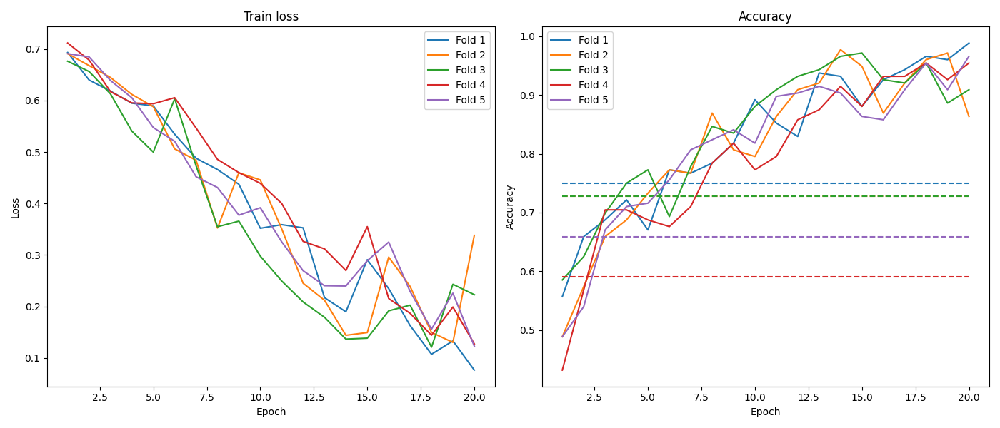
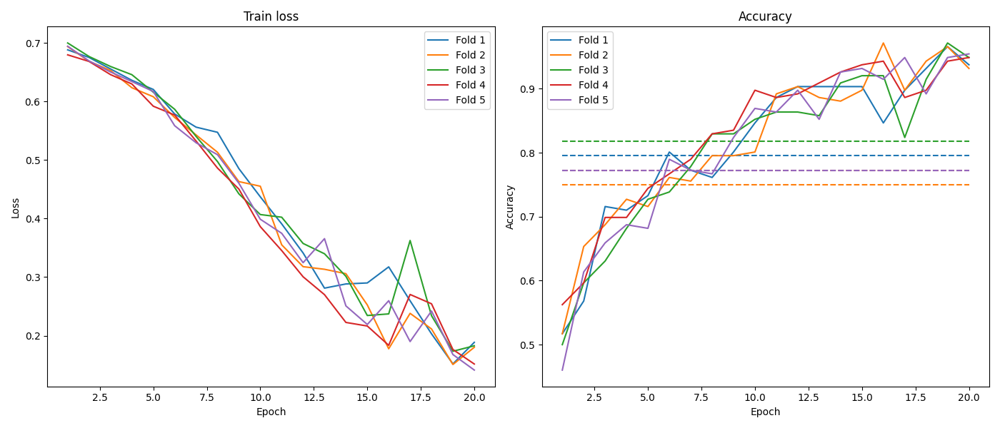
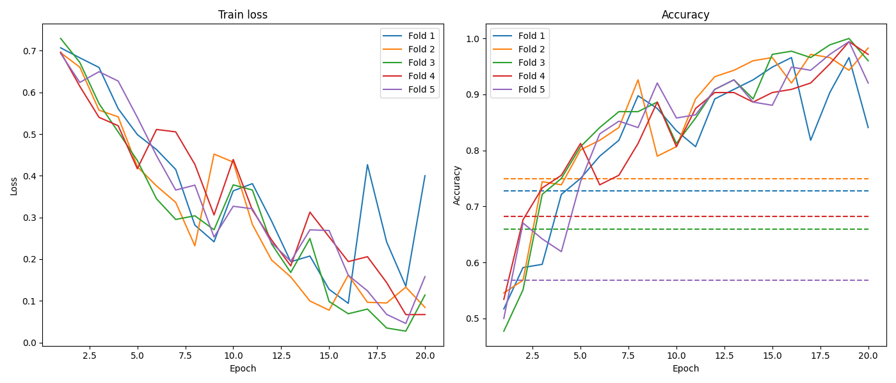
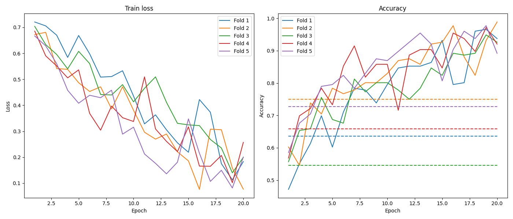
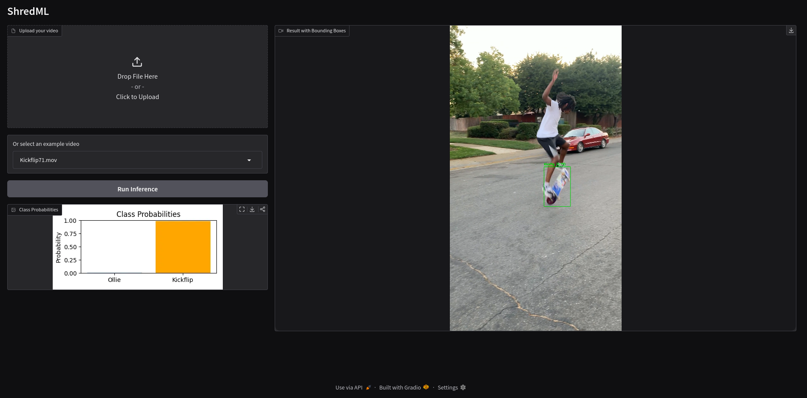

# ShredML
### Live demo available at [shredml.duckdns.org](https://shredml.duckdns.org)

**Title:** ShredML \
**Topic:** Skateboarding Trick Classification \
**Author:** Matteo Ruby \
**Date:** Feb 2026

As part of the course Machine Learning at HTW Berlin.

ShredML  implements a skateboarding trick classifier based on an LSTM architecture, inspired by [LightningDrop/SkateboardML](https://github.com/LightningDrop/SkateboardML).  
The key difference in this project is the use of YOLO-based preprocessing to crop video frames to the skateboard itself, as the motion of the board is generally the most important cue for trick classification. While foot stance (goofy/regular) can also play a role, this is not explicitly considered, as cropped frames usually include enough of the legs to implicitly capture stance information.

---

## Installation

The easiest setup method would be to use the Dockerfile after cloning the repo:  

```bash
cd ShredML
docker build -t [image name] .
docker create --gpus all --name [container name] [image name]
docker start [contaier name]
```

The project makes use of the following python packages:
- torch
- opencv-python
- ultralytics
- scikit-learn
- tqdm
- fastapi
- gradio
---

## Data

The dataset used is sourced from [LightningDrop/SkateboardML](https://github.com/LightningDrop/SkateboardML).  

- **Classes:** Kickflip (114 videos), Ollie (108 videos)  
- **Video length:** ~2 seconds per clip  
- **Format:** .mov videos  
- **Preprocessing issue:** Videos 83 and 91 (Ollie) were removed because the preprocessing pipeline produced no output, possibly due to failure to detect a skateboard. I did not have the time to troubleshoot this any further.

### Preprocessing

1. Video frames are extracted from each clip.  
2. A YOLO model (YOLO26n by default) estimates bounding boxes for the skateboard.  
3. Frames are cropped to the bounding boxes and loaded into a torch dataset.  
4. Each training example consists of 40 frames  

### Dataset characteristics

- **Class balance:** Nearly balanced (Kickflip: 114, Ollie: 106 after preprocessing)  
- **Format after preprocessing:** Sequence of cropped images per video  
- **Biases:** The dataset is limited to only two trick classes

---

## Model Details

The current model is a **ResNet18 feature extractor** followed by an **LSTM** and a **fully connected linear classifier**.  

```python
class FeatureExtractor(nn.Module):
    def __init__(self):
        super().__init__()
        backbone = resnet18(weights=ResNet18_Weights.IMAGENET1K_V1)
        self.features = nn.Sequential(*list(backbone.children())[:-1])
        self.out_dim = 512

        for param in self.features.parameters():
            param.requires_grad = False

    def forward(self, x):
        x = self.features(x)
        x = torch.flatten(x, 1)
        return x
```

```python
class LSTMClassifier(nn.Module):

    def __init__(self, feature_extractor: FeatureExtractor, num_classes):
        super().__init__()

        self.feature_extractor = feature_extractor

        self.lstm = nn.LSTM(
            input_size=feature_extractor.out_dim,
            hidden_size=256,
            batch_first=True
        )

        self.classifier = nn.Sequential(
            nn.Linear(256,128),
            nn.ReLU(),
            nn.Dropout(0.5),
            nn.Linear(128, num_classes)
        )

    def forward(self, x):
        B,T,C,H,W = x.shape
        x = x.view(B*T, C, H, W)
        features = self.feature_extractor(x)
        features = features.view(B, T, -1)
        lstm_out, _ = self.lstm(features)
        last = lstm_out[:, -1]
        return self.classifier(last)
```

- **Feature extractor:** ResNet18 pretrained on ImageNet, output dimensions: 512
- **Sequence model:** LSTM
- **Classifier:** Two linear layers with ReLU and dropout inbetween 
- **References:** [ResNet paper](https://arxiv.org/abs/1512.03385)  

---

## Training

- **Epochs:** 20  
- **Batch size:** 16 
- **Learning rate**: 0.001
- **Cross validation**: 5-fold; 80% train, 20%  test
- **Loss function:** Cross-entropy 
- **Optimizer:** Adam
- **Device:** GPU: RTX5070 with 12GB GDDR7

---

## Evaluation

## Model Configurations

The following table summarizes the different LSTM classifier hyperparameters used for comparison.
Number of classes N = 2.

| Model | LSTM Hidden Size | Linear Layer Dims | Dropout |
|------|------------------|--------------------------|---------|
| Small | 128 | 128 -> 64 -> 32 -> N | 0.5 |
| Medium | 256 | 256 -> 128 -> N | 0.5 |
| Large | 384 | 384 -> 192 -> N | 0.5 |
| Largest | 512 | 512 -> 256 -> N | 0.5 |



*Figure 1: Small Model*


*Figure 2: Medium Model*


*Figure 3: Large Model*


*Figure 4: Largest Model*


---

## Deployment

All components run on Docker. A live demo is availavle at https://dshredml.duckdns.org.

 
**FastAPI** and **Gradio**:  

- **FastAPI:** Accepts a video upload at POST /inference. Returns a Job ID. The result can then be polled with GET /inference/{id} and returns predicted trick class as well as bounding boxes for the Skateboard.  
- **Frontend:** A Gradio web interface allowing for uploading own Videos or choosing from the SkateboardML-Dataset. It visualizes the bounding boxes from YOLO, it's confidence as well as the predicted class probabilities.


*Figure 5: UI*


---

## Possible Use Cases
- Automated trick recognition for **S.K.A.T.E.** games (but there is arguably no real demand for it)
- Automated statistical or competitive analysis for skateboarding competitions (e.g., X-Games)  

---

## Prospects / Future Work

- **Synthetic data generation:** Using the game **Skate 3** to create videos of additional tricks.  
  - Record gamepad inputs for specific tricks  
  - Replay inputs with different camera angles  
  - Automatically capture videos and generate labeled training data  
  - Evaluate real live performance of models trained on synthetic data
  - If feasible, this could be used to extend the output classed beyond Kickflips and Ollies
- **Improved preprocessing:** Consider foot stance/body poses, do data augmentation
